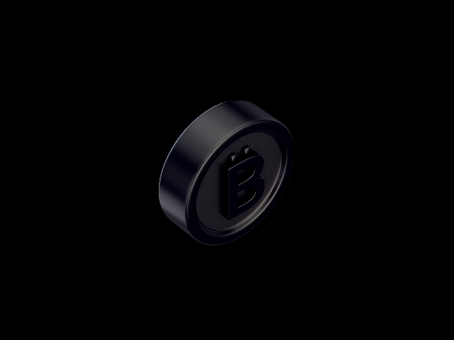

<h1 align="center">Hi 👋, I'm Rahul Guggilam</h1>
<h3 align="center">A Blockchain Enthusiast</h3>
<!-- | -->

  

- 🌱 I’m currently learning **Blockchain**

- 💬 Ask me about **python ,c , competitive programming**

- 📫 How to reach me **rahulguggilam2003@gmail.com**

- ⚡ Fun fact **I think I am Funny**

<h3 align="left">Connect with me:</h3>

<h3 align="left">Languages and Tools:</h3>

 

               

&nbsp;

